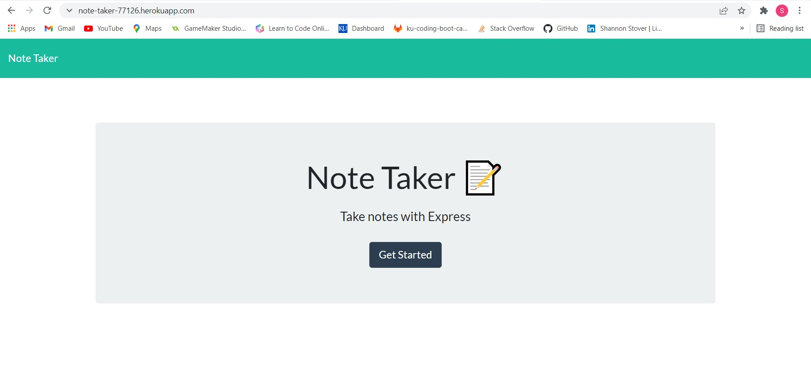
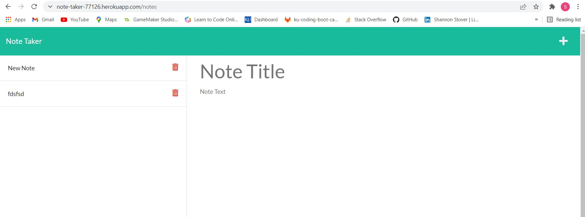

# Express.js Challenge: Note Taker

## Description

```
The client requested an application that could be used to create
notes so they can keep track of tasks that need to be completed.
The application is required to be deployed to Heroku. This
application uses the Express database to hold each note that
appears in the application.
```

## User Story

```
AS A small business owner
I WANT to be able to write and save notes
SO THAT I can organize my thoughts and keep track of
tasks I need to complete
```

## Acceptance Criteria

```
- It is done when the user opens the Note Taker and is presented
with a landing page with a link to a notes page.

- It is done when the user clicks on the link to the notes page
and is then presented with a page with existing notes listed in
the left-hand column, plus empty fields to enter a new note title
and the note’s text in the right-hand column.

- It is done when the user enters a new note title and the note’s
text, then a Save icon appears in the navigation at the top of
the page.

- It is done when the user clicks on the Save icon and then the
new note the user entered is saved and appears in the left-hand
column with the other existing notes.

- It is done when, after the user clicks on an existing note in
the list in the left-hand column, that note appears in the
right-hand column.

- It is done when a user clicks on the Write icon (+) in the
navigation at the top of the page, they are presented with empty
fields to enter a new note title and the note’s text in the
right-hand column.
```

The following images demonstrates the application functionality:

The application in the terminal



The HTML file generated after closing out the application



## Review

You are required to submit the following for review:

- The URL of the functional, deployed application: https://note-taker-77126.herokuapp.com/

- The URL of the GitHub repository: https://github.com/sstover25/Note_Taker

---

## Installation

```
To use this applicaiton, you must have Node.js installed, followed
by Express (npm i express) and nanoid (npm install --save nanoid) installed.
```

## Credits

```
Coding assistance from KU bootcamp modules, https://developer.mozilla.org/,
Express documentation, nanoid documentation, and Stack Overflow.
```

© 2021 Trilogy Education Services, LLC, a 2U, Inc. brand.
Confidential and Proprietary. All Rights Reserved.
